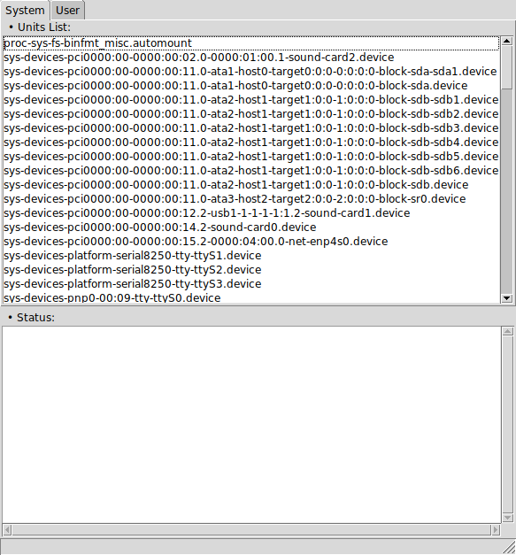

# tSystemd
**tSystemd** is a simple [systemd](https://www.freedesktop.org/wiki/Software/systemd) unit viewer written in core [Tcl/Tk](https://www.tcl.tk).

##### Features:
* Display System Units
* Display User Units

### Screenshot

## DEPENDENCIES
**Tcl** version 8.5 or later.

**Tk** version 8.5 or later.

## LICENSE
**tSystemd** is licensed under the **MIT License**.

Read LICENSE for details.
